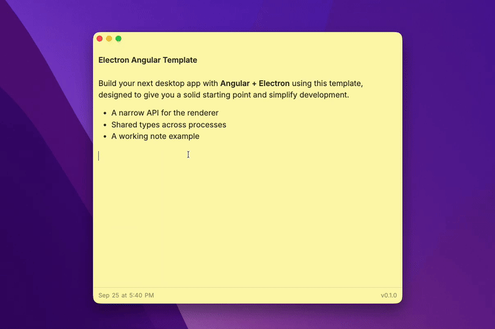

# Electron Angular Template

[](https://github.com/cchandurkar/electron-angular-template/actions/workflows/ci.yml)
[](LICENSE)

[](package.json)
[](packages/renderer/package.json)

An Electron starter for developers who want to build a desktop app with Angular. It gives you a working window, a typed bridge between Angular and Electron, cross-platform builds, and a small note-taking example that saves data locally.



## 📚 Contents

- [This Is a Highly Opinionated Template](#-this-is-a-highly-opinionated-template)
- [The Preload Bridge Is the Point](#-the-preload-bridge-is-the-point)
- [Get Started](#-get-started)
- [Project Layout](#%EF%B8%8F-project-layout)
- [Add an IPC Channel](#-add-an-ipc-channel)
- [Make It Yours](#-make-it-yours)
- [Available Scripts](#%EF%B8%8F-available-scripts)
- [Troubleshooting](#-troubleshooting)
- [How This Compares](#-how-this-compares)
- [Documentation](#-documentation)

## ⚡ This Is a Highly Opinionated Template

The template starts with standalone, zoneless Angular, separate npm workspaces for the renderer, main process, and shared contract, and a frameless window. It gives you a working desktop app with a specific way to organize code and cross the process boundary. The note editor demonstrates that structure; it is not a required part of your app.

If those defaults fit what you want to build, you can start with the example and replace it piece by piece. If you want a different Angular setup or window design, expect to change those choices early.

## 🌉 The Preload Bridge Is the Point

The bridge between Angular and Electron is part of the starter, not something you have to design before building your first feature:

- The renderer stays sandboxed and isolated; the preload exposes a narrow `window.electronApi` instead of raw `ipcRenderer`.
- One shared IPC contract supplies channel names, TypeScript argument and result types, and the preload's channel allowlists.
- The note example exercises the path from Angular through preload to a main-process handler and local storage.

The allowlists check channel names, not payload values or sender identity. Validate both in main when you add privileged operations. See [the IPC guide](CONTRIBUTING.md#ipc-channel-contract) and [security notes](SECURITY.md) for details.

## 🚀 Get Started

You'll need:

- Node.js 22.12.0+ (v24 recommended — see `.nvmrc`)
- npm 10.0.0+

Use **[Use this template](https://github.com/new?template_name=electron-angular-template&template_owner=cchandurkar)** on GitHub to create your own repository, or clone this one to try it locally:

```bash
git clone https://github.com/cchandurkar/electron-angular-template.git
cd electron-angular-template
npm install
npm start
```

`npm start` builds the shared types, starts the Angular dev server, and opens Electron. Edit the Angular UI and it updates during development; changes to the main process or preload script restart Electron.

The app opens to a small note editor. Type something, close the app, and open it again to see the example's local save/load flow.

## 🗂️ Project Layout

Three npm workspaces, one per runtime, plus an E2E suite that drives the built app:

```
packages/
├── main/                 Electron main process (Node)
│   ├── src/
│   │   ├── index.ts      App lifecycle, dev reload
│   │   ├── window.ts     BrowserWindow + security settings
│   │   ├── ipc.ts        ipcMain handlers (calls into storage.ts)
│   │   ├── ipc-bridge.ts Typed handle/listen/broadcast wrappers
│   │   ├── storage.ts    userData file storage
│   │   └── preload/      contextBridge script, bundled to CJS for the sandbox
│   ├── assets/icons/     App icons for electron-builder
│   └── electron-builder.json
├── renderer/             Angular app (browser sandbox, no Node access)
│   └── src/app/
│       ├── components/   Standalone components (note editor, header)
│       ├── services/     ElectronService: the renderer's door to IPC
│       └── models/       Renderer-local classes
└── shared/               Wire contract consumed by all three runtimes
    └── src/
        ├── ipc/index.ts  Channel names, payload types, derived allowlists
        └── models/       Plain data types that cross IPC (interfaces only)
e2e/                      Playwright tests against the built Electron app
scripts/rebrand.mjs       Interactive rename helper
```

## 🔌 Add an IPC Channel

Three edits, one per runtime. This example adds a request/response channel that returns the user's home directory.

**1. Declare it in the shared contract** ([`packages/shared/src/ipc/index.ts`](packages/shared/src/ipc/index.ts)). The types and the preload allowlist are derived from this object, so this is the only change in `shared`:

```ts
const INVOKE_CHANNEL_DEFS = {
  'app:versions': undefined as unknown as InvokeDef<[], AppVersions>,
  'app:home-dir': undefined as unknown as InvokeDef<[], string> // new
  // ...
};
```

**2. Handle it in main** ([`packages/main/src/ipc.ts`](packages/main/src/ipc.ts)). `handle()` infers the argument and return types from the channel name:

```ts
import { app } from 'electron/main';

handle('app:home-dir', () => app.getPath('home'));
```

**3. Call it from Angular** ([`packages/renderer/src/app/services/electron/electron.service.ts`](packages/renderer/src/app/services/electron/electron.service.ts)):

```ts
async loadHomeDir(): Promise<string | null> {
  if (!this.isElectron) return null;
  return window.electronApi.invoke('app:home-dir');
}
```

Use `SEND_CHANNEL_DEFS` with `listen()` for renderer-to-main fire-and-forget messages (the window controls use this), and `PUSH_CHANNEL_DEFS` with `broadcast()` for main-to-renderer events. The `updater:status` push channel is declared as placeholder for you to wire up; nothing in main emits them yet.

Send plain data only. If you accept arguments in a privileged handler, validate them in main before acting on them; the contract gives you types, not runtime checks.

## 🛼 Make it yours

After creating a repository from the template, run the interactive rebrand helper:

```bash
npm run rebrand
```

It updates package and repository metadata, the app's display name and ID, the in-app title, the license, and several GitHub links. It runs only when you ask it to. Review the diff before committing.

Then replace the app icons in [`packages/main/assets/icons`](packages/main/assets/icons), the renderer's [`favicon.ico`](packages/renderer/public/favicon.ico), and the generic HTML title in [`packages/renderer/src/index.html`](packages/renderer/src/index.html). Remove the note example once you've used it to understand the wiring.

Before distributing an app, set the identity and release settings you need, including signing and notarization where applicable. The template intentionally does not configure a signing identity, an update server, or automatic updates.

### What is example, what is template

Everything about notes exists to demonstrate the wiring and can be deleted:

| Example (safe to remove)                                                                                   | Template (keep)                                                             |
| ---------------------------------------------------------------------------------------------------------- | --------------------------------------------------------------------------- |
| `packages/renderer/src/app/components/note/`                                                               | `packages/renderer/src/app/services/electron/`                              |
| `packages/renderer/src/app/models/note.ts`, `packages/shared/src/models/note.ts`                           | `packages/shared/src/ipc/index.ts`                                          |
| `note:save` / `note:load` channels, their handlers in `ipc.ts`, `saveNote`/`loadNote` in `ElectronService` | `packages/main/src/ipc-bridge.ts`, `storage.ts`, `window.ts`                |
| Renderer dependencies `@tiptap/*`, `@floating-ui/dom`                                                      | `packages/main/src/preload/`                                                |
| The `lastEditedAt` / `NoteComponent` wiring in `app.component.ts` and `app.routes.ts`                      | The header component (it uses `@lucide/angular`; keep or swap the icon set) |

The frameless header with custom window controls is also a design choice, not a requirement. If you prefer a native title bar, set `frame: true` in `window.ts` and drop the header component.

Before distributing an app, set the identity and release settings you need, including signing and notarization where applicable. The template intentionally does not configure a signing identity, an update server, or automatic updates.

## 🛠️ Available Scripts

Run these commands from the repository root:

| Command                | Description                                              |
| ---------------------- | -------------------------------------------------------- |
| `npm start`            | Start development mode (Angular + Electron)              |
| `npm run build`        | Compile all packages (no installers)                     |
| `npm run package`      | Compile + package into installers (`.dmg`/`.exe`/etc.)   |
| `npm run clean`        | Clean all build artifacts                                |
| `npm run lint`         | Lint all packages                                        |
| `npm run lint:fix`     | Fix linting issues in all packages                       |
| `npm run format`       | Format code with Prettier                                |
| `npm run format:check` | Check code formatting                                    |
| `npm run test`         | Run tests in all packages                                |
| `npm run typecheck`    | Type-check all packages                                  |
| `npm run verify`       | Run format:check + lint + typecheck + tests — same as CI |
| `npm run dev:debug`    | Start development mode with remote debugging (port 9222) |

The CI workflow runs checks and packaging on macOS, Windows, and Linux.

## 🧯 Troubleshooting

#### Cannot find module '@local/shared'

Main and renderer compile against the shared package's built output. Run `npm run shared:build` first, or use the root scripts (`npm start`, `npm run lint`, `npm run typecheck`), which build it for you.

#### Electron fails to launch on Ubuntu 24.04+ (sandbox / user namespace error)

Ubuntu 24.04 restricts unprivileged user namespaces via AppArmor, which prevents Electron's sandbox from initializing. In CI and disposable environments you can allow it with:

```bash
sudo sysctl -w kernel.apparmor_restrict_unprivileged_userns=0
```

This is a host setting, not an app setting; the shipped app's sandbox configuration is unaffected. See [electron/electron#41066](https://github.com/electron/electron/issues/41066) for context.

#### Missing shared libraries on Linux (`libnss3`, `libatk`, ...)

Install Chromium's runtime dependencies with `sudo npx playwright install-deps`, or the equivalent packages for your distribution.

#### Angular UI doesn't update after an async callback

This app is zoneless. State read by templates must be a signal, go through `AsyncPipe`, or call `markForCheck()`. Data arriving from an IPC listener does not trigger change detection on its own; `ElectronService` shows the signal pattern.

#### Playwright E2E: blank window or preload not found

Launch Electron with the `packages/main` directory, not the compiled `index.js` path. Electron resolves `app.getAppPath()` from the launched directory's `package.json`; given a bare file it falls back to its internal default app and every relative path in `window.ts` breaks silently. `e2e/tests/app.spec.ts` already does this correctly.

#### `npm run package` fails on Linux

The default Linux targets include Flatpak, which needs `flatpak`, `flatpak-builder`, and the `org.freedesktop.Platform` 25.08 runtime installed. See the Linux steps in [`.github/workflows/ci.yml`](.github/workflows/ci.yml) for the exact commands, or remove the `flatpak` target from `packages/main/electron-builder.json` if you don't need it.

#### Default Electron icon in the macOS Dock during development

Expected. `electron .` has no bundled `.icns`; `index.ts` sets the Dock icon explicitly in dev, and packaged builds embed the generated icon.

## 🔍 How This Compares

- **[angular-electron](https://github.com/maximegris/angular-electron)** is the long-standing Angular + Electron starter with a single-package layout. Compared to that, this template separates main, renderer, and the shared contract into workspaces so the process boundary is enforced by the build, ships zoneless standalone Angular, and treats the typed IPC bridge as the core feature rather than an add-on.
- **[electron-vite](https://electron-vite.org/)** is framework-agnostic and bundles all processes with Vite. This template keeps the Angular CLI as the renderer build (so `ng generate`, `ng test`, and Angular's own tooling work unmodified) and uses `tsc` plus a small esbuild step for main and preload.

If you want a single-package layout or a non-Angular renderer, one of those is probably a better fit.

## 📖 Documentation

- [Main process](packages/main/README.md): Electron lifecycle, preload, IPC, and build
- [Renderer](packages/renderer/README.md): Angular structure, development, and tests
- [Shared package](packages/shared/README.md): wire types and channel contract
- [Contributing](CONTRIBUTING.md): setup, conventions, and pull requests
- [Security](SECURITY.md): security defaults and vulnerability reports

Contributions and issue reports are welcome. Please read [CONTRIBUTING.md](CONTRIBUTING.md) and the [Code of Conduct](CODE_OF_CONDUCT.md) before opening a pull request.

Licensed under [MIT](LICENSE).
